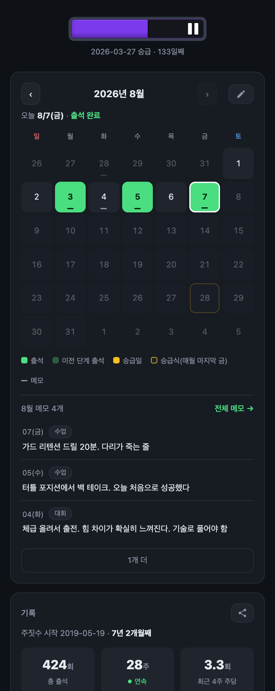
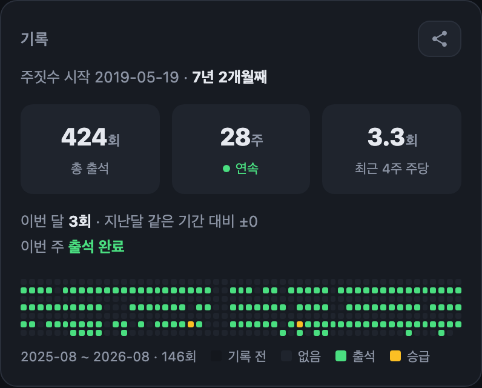
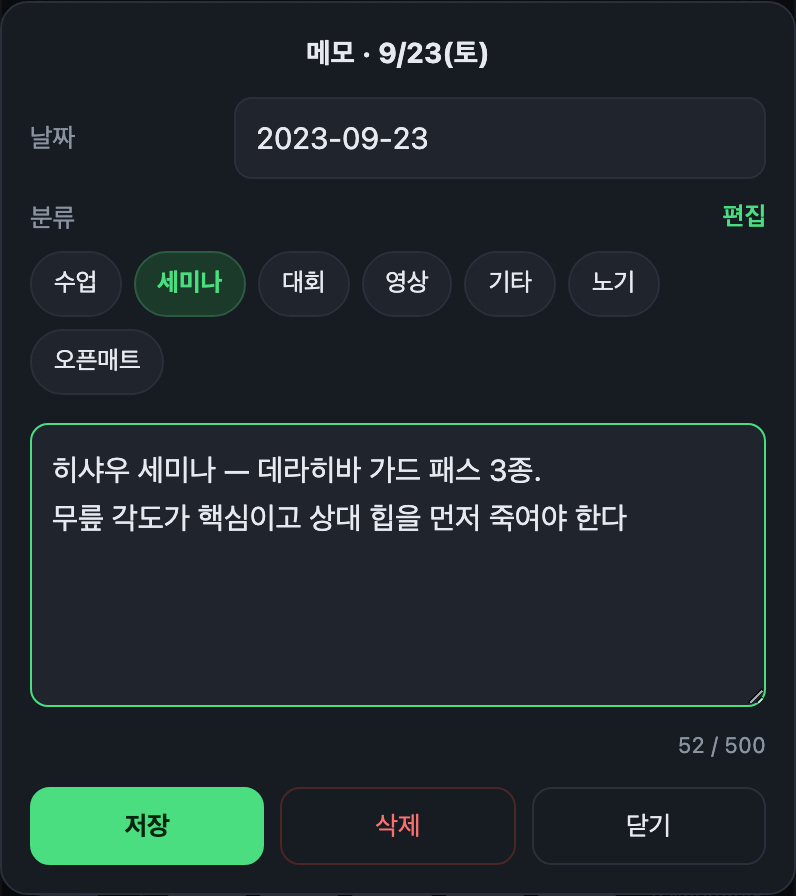
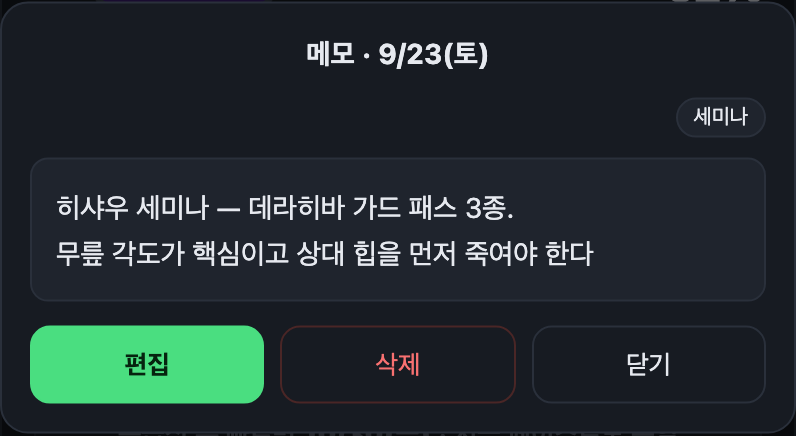
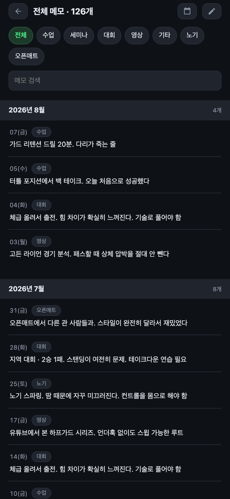
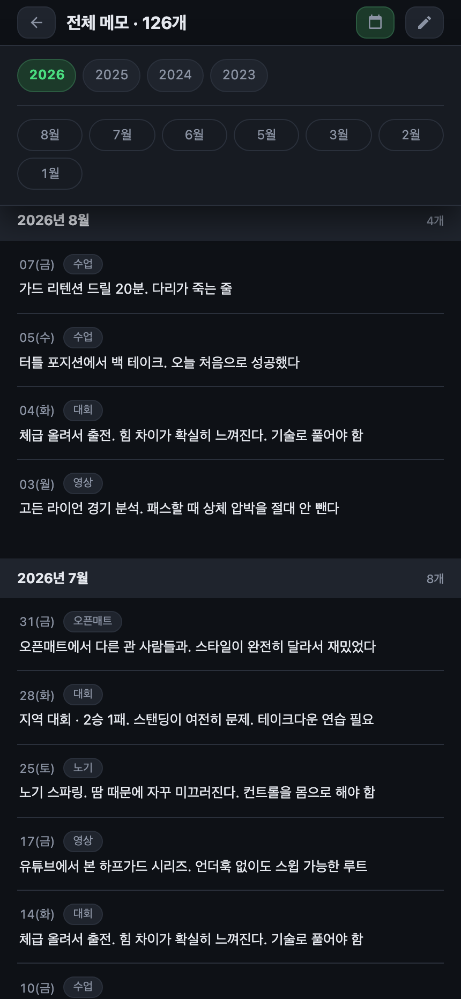
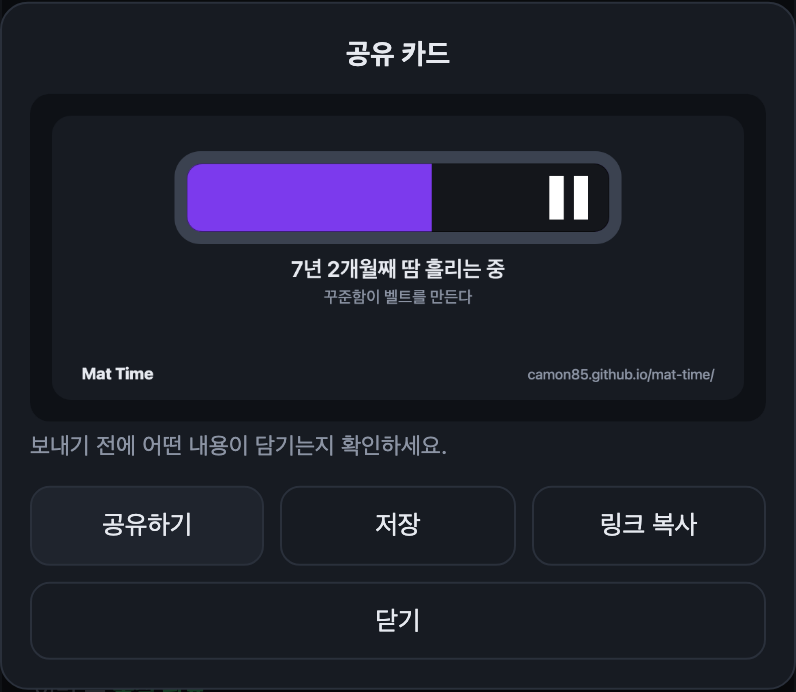
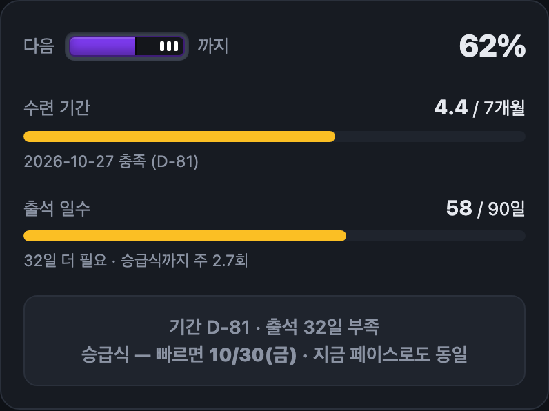
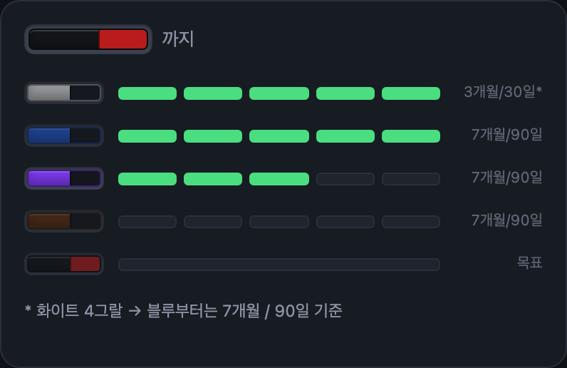

# Mat Time 🥋

오늘 매트 밟았으면 톡 한 번. 다음 그랄까지 얼마나 남았는지 알려주는 앱이에요.

### 👉 **https://camon85.github.io/mat-time/**

설치도, 가입도, 로그인도 없어요. 링크 열면 바로 시작.

---

## 뭘 해주는 앱인가요

| | |
|---|---|
| 🗓 **출석 체크** | 달력에서 오늘 톡. 깜빡한 날도 그 날짜 눌러서 채우기 |
| 🥋 **승급 진행도** | 다음 그랄까지 기간·출석이 얼마나 찼는지, 언제쯤 받을지 |
| ✏️ **수련 메모** | 배운 기술·세미나·대회·본 영상을 그날 날짜에 |
| 📸 **공유 카드** | 내 띠를 이미지 한 장으로 |
| ☁️ **자동 백업** | 깃허브 계정만 있으면 폰·PC가 같은 기록 |

---

## 딱 2분, 처음 한 번만

**1. 홈 화면에 올려두기**

매일 열 거니까 앱처럼 두는 게 편해요.

- 아이폰: 사파리로 열고 → 공유 → **홈 화면에 추가**
- 안드로이드: 크롬으로 열고 → 메뉴 → **홈 화면에 추가**

**2. 지금 내 벨트 알려주기**

맨 아래 톱니 아이콘이 있는 `설정 · 승급 이력 · 백업` 줄을 눌러서

- **주짓수 시작일** — 처음 도장 등록한 날. 기억 안 나면 비워두셔도 돼요
- **＋ 승급 기록** — 마지막으로 그랄이나 벨트 받은 날짜를 넣어주세요

이거 한 번이면 현재 벨트랑 진행도가 알아서 맞춰집니다.
아무것도 안 넣으면 화이트 0그랄로 시작해요.

---

## 매일은 이거 하나

**달력에서 오늘 날짜 톡. 그게 다예요.**

- 초록 테두리 쳐진 칸이 오늘이에요
- 잘못 눌렀으면 한 번 더 누르면 취소돼요
- 어제 찍는 걸 깜빡했다? 그 날짜 그냥 누르면 돼요
- 흐릿한 앞뒤 달 날짜는 안 눌려요 (그 달로 넘겨서 누르세요)

찍고 나면 「기록」 카드에서 그동안 쌓인 게 보입니다.

- **총 출석 / 연속 / 최근 4주 주당** — 성격이 다른 세 숫자예요. 쌓인 양, 안 끊긴 기간, 요즘 속도
- **잔디** — 최근 1년. 빈칸 많아도 괜찮아요, 채워가는 재미니까.
  왼쪽 끝 어두운 칸은 **앱 쓰기 전**이라 데이터가 없는 구간이고, 노란 칸은 승급한 날이에요

---

## 오늘 뭐 배웠더라 ✏️

달력 오른쪽 위 **연필**을 누르면 그날 메모를 남길 수 있어요.

배운 기술, 세미나에서 들은 말, 대회 결과, 본 영상, 혼자 깨달은 것.
석 달 뒤에 「그때 그거 뭐였지」 할 때 찾아보라고 있는 칸이에요.

- **분류**를 골라두면 나중에 「대회」만 모아 보기 좋아요 (수업 · 세미나 · 대회 · 영상 · 기타)
- 분류가 아쉬우면 `분류` 옆 **편집** → `＋ 분류` 로 직접 만드세요.
  「노기」「오픈매트」처럼요. 최대 10개까지, 이름은 10자 이내
- 안 쓰는 분류는 편집 모드에서 `×` 로 지웁니다. 그 분류를 쓰던 메모는 사라지지 않고
  첫 번째 분류로 옮겨져요 (몇 개가 옮겨지는지 먼저 알려드립니다)
- 500자까지, 줄바꿈도 됩니다
- **출석이랑은 완전히 별개예요.** 대회 나간 날은 도장에 안 갔고 영상은 매트를 안 밟잖아요.
  메모를 써도 출석은 안 켜지고, 출석을 취소해도 메모는 그대로 남아요
- 메모가 있는 날은 달력에 작은 줄(`—`)이 생겨요

### 다시 읽기

**바로 그 자리에서요.** 달력 아래에 그 달 메모가 쭉 나와 있고, `‹` `›` 로 달을 넘기면
메모도 같이 넘어갑니다.

메모를 누르면 **먼저 읽기 화면**이에요. 실수로 고쳐지지 않게요. 고치려면 `편집`을 누르세요.

### 오래된 것 찾기

**전체 메모 →** 를 누르면 화면이 통째로 바뀌면서 전부 나와요.

- **`2026년 8월` 처럼 달마다 묶여** 있고, 해가 바뀌는 곳엔 굵은 선이 그어져요
- 분류 칩으로 걸러 보거나 검색창에 단어를 넣으면 돼요.
  **아무리 내려도 맨 위에 그대로 붙어** 있습니다
- 여기서도 오른쪽 위 연필로 새 메모를 쓸 수 있어요
- 돌아올 땐 왼쪽 위 `←` 나 그냥 **폰 뒤로가기** — 보던 자리로 돌아옵니다

몇 년 전으로 건너뛰려면 오른쪽 위 **달력 아이콘**. 연도와 달이 펼쳐집니다.

올해 안에서는 두 번, 몇 년 전으로 가도 세 번 탭이면 도착해요.
도착한 곳이 잠깐 반짝여서 어디로 왔는지 바로 보입니다.

---

## 그랄 받은 날 🎉

`설정` → **＋ 승급 기록** → 날짜 고르고, 벨트 누르고, 그랄 숫자 누르면 끝.

기본값이 **오늘 + 다음 그랄**이라 대부분은 그냥 `기록`만 누르면 됩니다.
잘못 넣었으면 목록에서 `삭제` 누르세요. 알아서 이전 상태로 돌아가요.

## 자랑하고 싶을 때 📸

「기록」 카드 오른쪽 위 공유 아이콘을 누르면 **내 띠가 이미지 한 장**으로 만들어져요.

- **공유하기** — 카톡·인스타로 바로 (폰에서)
- **저장** — 이미지 파일로 받기
- **링크 복사** — 이미지 없이 주소만

보내기 전에 미리보기가 뜨니까 뭐가 담기는지 확인하고 보내면 돼요.
**그랄 받은 날엔 알아서 카드를 띄워줍니다** — 그날이 제일 자랑하고 싶은 날이니까요.

> 출석 횟수나 잔디는 일부러 안 넣었어요. 앱을 최근에 쓰기 시작했으면 숫자가 실제 수련량이랑
> 안 맞아서, 6년 한 사람이 초보처럼 보이거든요. 카드엔 **언제 시작했든 정확한 것**만 담습니다.

---

## ⚠️ 이것만은 꼭

**기록은 이 브라우저 안에만 있어요.** 폰 바꾸거나 브라우저 데이터 지우면 같이 사라집니다.
1년치 출석과 메모가 날아가면 진짜 속상하니까, 둘 중 하나는 꼭 해두세요.

### 방법 1. 깃허브 연결 — 한 번 하고 잊기 (추천)

연결해두면 출석·메모가 알아서 백업되고, **폰이랑 PC에서 같은 기록**을 봐요.
깃허브 계정만 있으면 됩니다.

1. `설정` → **토큰 발급 →** 링크 열기
2. 만료 기간만 고르고 **Generate token** (권한은 이미 체크돼 있어요)
3. 나온 값 복사해서 **깃허브 토큰** 칸에 붙여넣고 **연결**

다른 기기에서도 같은 토큰만 넣으면 기록이 따라옵니다.
토큰은 **gist 권한만** 가져서 저장소나 계정 설정은 건드리지 못하고, 백업 파일에도 안 들어가요.

### 방법 2. 파일로 저장 — 가끔 눌러주기

`설정` → **백업 (JSON)** 누르면 파일이 하나 받아져요.
새 기기에서 **복원**으로 그 파일 넣으면 그대로 돌아옵니다.

> 복원은 형식이 맞지 않으면 **아예 받지 않아요.** 반쯤 읽다 말고 기록을 망가뜨리는 일은 없습니다.

---

## 승급까지 얼마나?

| 구간 | 수련 기간 | 출석 일수 |
|---|---|---|
| 화이트 0 → 4그랄 | 3개월 | 30일 |
| 화이트 4그랄 → 블루, 그 뒤로 블랙까지 | 7개월 | 90일 |

- **둘 다** 채워야 해요. 그래서 진행률은 덜 찬 쪽을 기준으로 보여줍니다
- **승급식은 매월 마지막 금요일.** 기준 채웠다고 그날 바로가 아니라, 그다음 승급식에 올라가요
- 승급식 당일 수련은 이전 단계로 치고, **새 단계는 다음 날부터** 셉니다

`승급식 — 빠르면 10/30(금) · 이 페이스면 11/27(금)` 처럼 두 날짜가 뜨는데,
앞은 하루도 안 빠졌을 때고 뒤는 **지금처럼 다니면**이에요. 둘이 벌어져 있으면 좀 더 나가야 한다는 뜻.

블랙까지 남은 길은 맨 아래 로드맵에서 한눈에 봅니다.

---

## 화면 읽는 법

| 어디 | 뭘 말하나 |
|---|---|
| 맨 위 벨트 | 지금 내 벨트랑 그랄 |
| 달력 | 출석 체크. 초록이 나간 날. 칸 아래 짧은 줄은 메모 있는 날 |
| 달력의 노란 테두리 | 그 달 승급식(마지막 금요일) |
| 달력 아래 목록 | 그 달에 적어둔 메모. 달을 넘기면 같이 넘어감 |
| 기록 카드 | 총 몇 번, 몇 주 연속, 요즘 주당 몇 회 |
| 잔디 | 최근 1년 출석. 어두운 칸은 앱 쓰기 전, 노란 칸은 승급일 |
| **다음 [벨트] 까지 62%** | 다음 승급까지 얼마나 왔나 (덜 찬 쪽 기준) |
| 맨 아래 벨트 줄 | 블랙까지 남은 길 |

## 자주 묻는 것

**Q. 여러 기기에서 같이 쓰면 어떻게 되나요?**
깃허브를 연결해두면 출석 날짜는 합쳐지고, 한쪽에서 지운 건 다른 쪽에서도 지워집니다.
같은 날 메모를 양쪽에서 고쳤다면 **나중에 저장한 쪽**이 남아요.

**Q. 메모를 많이 쌓아도 느려지지 않나요?**
10년치(1,500개 남짓)를 한 번에 그려도 체감되지 않습니다. 대신 그만큼 길어지니까
연도·달로 건너뛰는 버튼을 뒀어요.

**Q. 도장 승급 기준이 달라요.**
지금은 위 표(3개월/30일 · 7개월/90일)로 고정돼 있어요.

---

오스! 🥋

앱을 고치거나 데이터를 직접 다루려면 → [`docs/implementation.md`](docs/implementation.md) · [`docs/data-format.md`](docs/data-format.md)
